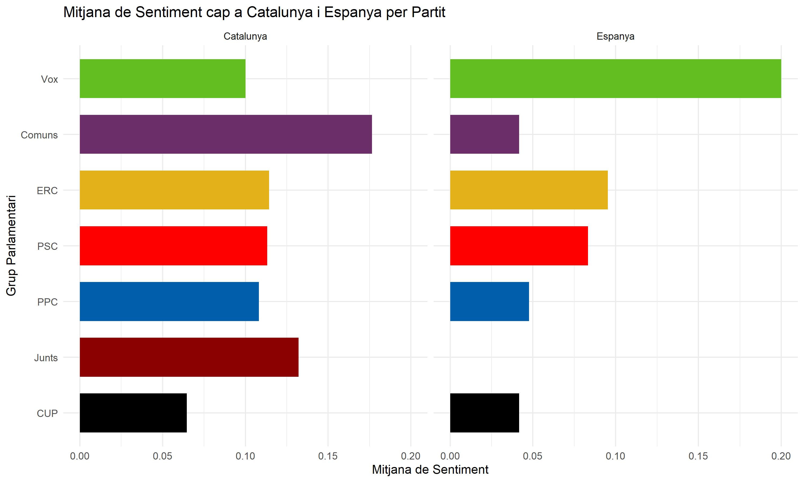
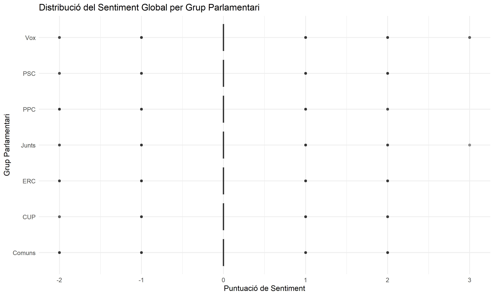
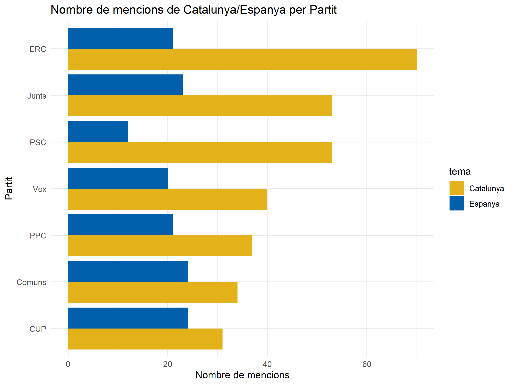

# Anàlisi de Sentiments en Debats Parlamentaris

Aquest projecte presenta una anàlisi computacional del discurs i de la polaritat dels sentiments en debats parlamentaris, desenvolupat completament en **R**.

L'objectiu principal de l'estudi és anar més enllà del simple recompte de paraules per avaluar si el to emprat pels diferents grups parlamentaris és **positiu o negatiu**, posant especial focus en el context on s'emmarquen termes clau com "Catalunya" i "Espanya".

## 🛠 Metodologia

1. **Extracció i Neteja:** El text s'extreu directament dels diaris de sessions en PDF. Es processa i es divideix en frases, eliminant prèviament les paraules buides (*stopwords*) tant en català com en castellà.
2. **Classificació:** S'aplica un diccionari de sentiments híbrid (bilingüe) que assigna valors positius o negatius a cadascuna de les frases.
3. **Mapeig:** S'associen les frases detectades als diferents grups parlamentaris presents a la càmera.

---

## 📊 Resultats Clau

A l'espera d'una anàlisi més profunda amb més diaris de sessions, les dades de prova generen les següents mètriques globals de to:
- **Catalunya:** 318 mencions en total, amb un sentiment mitjà lleugerament positiu (**0.116**).
- **Espanya:** 145 mencions en total, amb un sentiment mitjà positiu però inferior (**0.069**).

### 1. Quin to fa servir cada partit?
Aquest gràfic mostra la mitjana de sentiment que ha emprat cada grup parlamentari quan ha pronunciat frases on apareix el terme "Catalunya" i el terme "Espanya".

### 2. Distribució de la Polaritat del Discurs
L'anàlisi no només ofereix la mitjana, sinó la variància. En aquest diagrama de caixes (*boxplot*) podem apreciar si el discurs general de cada formació política és molt homogeni, o si compta amb expressions summament positives i/o extremes negatives.

### 3. Protagonisme dels Temes en el Debat
Comptatge absolut de les vegades que cada grup parlamentari ha posat sobre la taula algun dels dos termes.

---
*Codi elaborat completament amb R, `tidytext` i `ggplot2`.*
